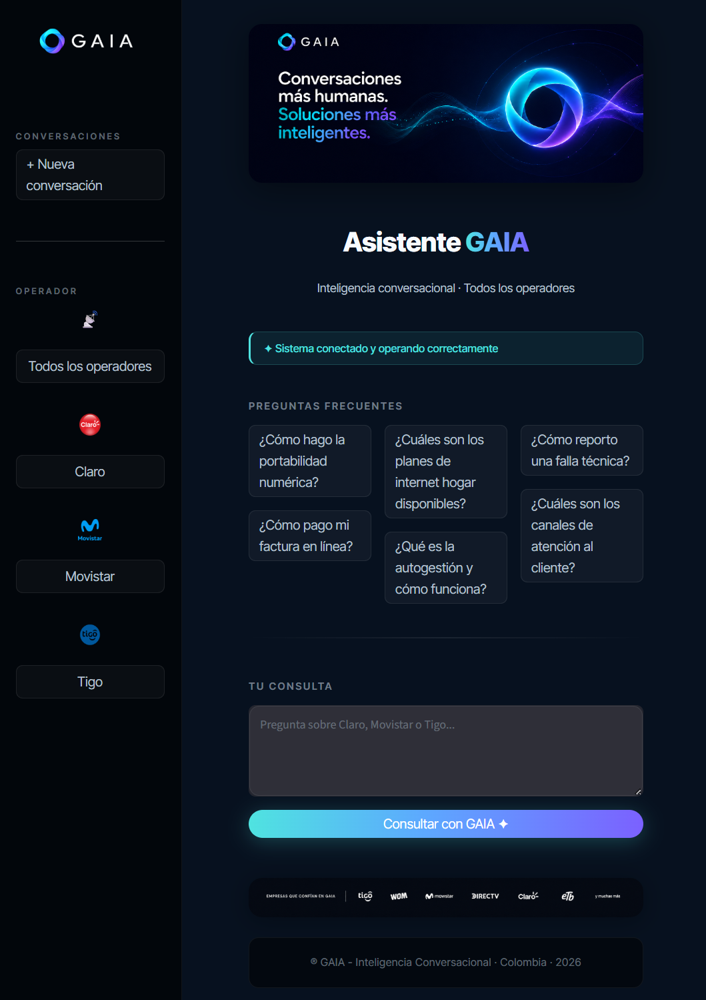
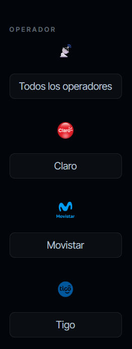
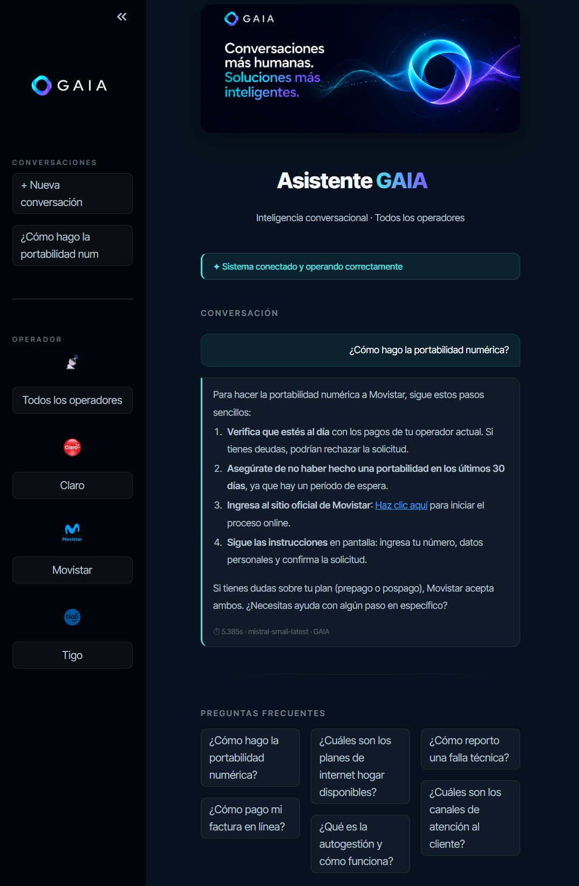

# GAIA — Asistente Conversacional de Telecomunicaciones

## Descripción General

GAIA es una plataforma conversacional inteligente desarrollada para el servicio al cliente de operadores de telecomunicaciones en Colombia. El sistema integra recuperación aumentada de generación (RAG), arquitectura de grafos conversacionales con LangGraph, y principios de Human-Centered AI (HCAI) y GenAI UX para ofrecer una experiencia empática, contextual y centrada en el usuario.

El proyecto es parte de una investigación académica sobre experiencia de usuario en sistemas de inteligencia artificial generativa, orientada a evaluar métricas como NPS, SUS, empatía percibida y satisfacción conversacional en comparación con chatbots tradicionales.

La implementación actual cubre los operadores Claro, Movistar y Tigo como caso 
de estudio, aunque la arquitectura es extensible a cualquier operador de 
telecomunicaciones mediante la configuración de nuevas fuentes de datos en 
src/config.py y la regeneración del vectorstore.

---

## Vista del Producto

### Interfaz principal


### Selector de operadores


### Conversación de ejemplo


---

## Arquitectura del Sistema

El sistema se compone de tres capas principales: la interfaz de usuario (Streamlit), la capa de API (FastAPI), y el motor de inteligencia conversacional (LangGraph + RAG).

### Flujo conversacional

```
Usuario
   |
Streamlit (interfaz web)
   |
FastAPI (API REST)
   |
LangGraph (grafo conversacional)
   |
   +-- classify_node   (router de intenciones con deteccion emocional)
   |
   +-- direct_node     (respuestas sociales, empaticas y de acompanamiento)
   |
   +-- product_node    (consultas comerciales, planes y tarifas)
   |
   +-- retrieve_node   (busqueda semantica en ChromaDB)
   |
   +-- generate_node   (generacion de respuesta con Mistral AI)
                |
           MLflow Tracing
```

### Pipeline de datos

```
Web Scraping
   |
   +-- claro.com.co
   +-- movistar.com.co
   +-- tigo.com.co / ayuda.tigo.com.co
   |
Procesamiento de texto (src/scraper.py)
   |
data/processed/*.txt
   |
Chunking + Embeddings (src/ingest.py)
   |
ChromaDB (vectorstore/)
```

---

## Tecnologias Utilizadas

| Componente | Tecnologia |
|---|---|
| Interfaz de usuario | Streamlit |
| API REST | FastAPI + Uvicorn |
| Motor conversacional | LangGraph |
| Modelo de lenguaje | Mistral AI (mistral-small-latest) |
| Embeddings | Ollama (nomic-embed-text) |
| Base de datos vectorial | ChromaDB |
| Web scraping | httpx + Playwright + BeautifulSoup4 |
| Tracking y metricas | MLflow |
| Memoria conversacional | SQLite |
| Monitoreo | Prometheus + Grafana |
| Gestion de dependencias | uv + pip |
| Entorno | Python 3.11 |

---

## Estructura del Proyecto

```
telecom-chatbot/
|
+-- app/
|   +-- assets/                  Logos, imagenes, favicon, banner
|   +-- streamlit_app.py         Interfaz GAIA con selector de operadores
|
+-- api/
|   +-- main.py                  FastAPI con endpoints /ask y /ask/graph
|   +-- __init__.py
|
+-- src/
|   +-- config.py                Configuracion centralizada desde .env
|   +-- scraper.py               Web scraper anti-deteccion con seed URLs
|   +-- ingest.py                Chunking, embeddings y construccion de ChromaDB
|   +-- rag_chain.py             Pipeline RAG simple con MLflow tracing
|   +-- memory.py                Memoria persistente en SQLite
|   +-- evaluate.py              Evaluacion del sistema RAG con metricas
|   +-- product_catalog.json     Datos estructurados de operadores
|   +-- __init__.py
|   |
|   +-- graph/
|       +-- state.py             Definicion del estado LangGraph (ChatState)
|       +-- nodes.py             Nodos del grafo: classify, direct, product, retrieve, generate
|       +-- build.py             Compilacion del grafo con checkpointer SQLite
|       +-- __init__.py
|
+-- data/
|   +-- raw/                     Datos crudos (no versionados)
|   +-- processed/               Archivos .txt generados por el scraper
|
+-- vectorstore/                 ChromaDB persistido (generado, no versionado)
+-- reports/
|   +-- evaluation/              Resultados JSON de evaluacion RAG
|
+-- docker/
|   +-- prometheus.yml           Configuracion de Prometheus
|
+-- tests/
|   +-- test_scraper.py          Tests unitarios del scraper
|   +-- test_api.py              Tests basicos de la API
|
+-- main.py                      Orquestador del pipeline completo
+-- requirements.txt             Dependencias del proyecto
+-- docker-compose.yml           Prometheus + Grafana
+-- Makefile                     Comandos de gestion del proyecto
+-- .env.example                 Plantilla de variables de entorno
+-- .gitignore
+-- README.md
```

---

## Arquitectura Conversacional

### Router de intenciones

El nodo `classify_node` analiza cada mensaje del usuario y determina una de tres rutas posibles:

- **direct**: saludos, despedidas, agradecimientos, expresiones emocionales, frustraciones generales, referencias a turnos anteriores, temas fuera del dominio de telecomunicaciones.
- **product**: consultas sobre planes, precios, tarifas, portabilidad numerica, puntos de atencion, activacion o cancelacion de servicios.
- **rag**: soporte tecnico, facturacion, recargas, autogestion, preguntas frecuentes, cobertura, procedimientos paso a paso.

El router tambien detecta senales emocionales implicitas como frustracion, urgencia o confusion para priorizar respuestas empaticas antes que tecnicas.

### Principios de GenAI UX y Human-Centered AI

Los prompts del sistema implementan los siguientes principios:

- Empatia conversacional: validacion emocional ante frustracion o urgencia antes de responder tecnicamente.
- UX Writing: lenguaje claro, simple, sin tecnicismos, con frases cortas y conversacionales.
- Adaptacion de tono: soporte tecnico (empatico y guiado), facturacion (claro y tranquilizador), consulta comercial (orientador), frustracion (contencion primero, solucion despues).
- Fallback humanizado: cuando la informacion no esta disponible, se orienta al usuario con calidez y se mantiene el acompanamiento conversacional.
- Continuidad conversacional: el historial se aprovecha para mantener coherencia sin tratar cada mensaje como una consulta nueva.
- Grounding estricto: no se inventa informacion. Las respuestas se basan exclusivamente en el contexto recuperado de ChromaDB.

### Endpoints de la API

| Endpoint | Descripcion |
|---|---|
| GET /health | Estado del sistema |
| POST /ask | Pipeline RAG simple (sin LangGraph) |
| POST /ask/graph | Pipeline con LangGraph (router + memoria checkpointer) |

La interfaz Streamlit apunta al endpoint `/ask/graph` para aprovechar el router inteligente y la memoria de sesion.

---

## Web Scraping

El modulo `src/scraper.py` implementa un crawler BFS (Breadth-First Search) con las siguientes caracteristicas anti-deteccion:

- Rotacion de User-Agents con pool de navegadores reales (Chrome, Firefox, Edge, Safari).
- Cabeceras HTTP completas que imitan un navegador Chrome real, incluyendo Sec-CH-UA, Sec-Fetch-Dest y Accept-Language en espanol colombiano.
- Delays aleatorios configurables entre peticiones (SCRAPE_DELAY_MIN y SCRAPE_DELAY_MAX).
- Reintento con backoff exponencial usando la libreria tenacity (hasta 3 intentos).
- Playwright como fallback para paginas que requieren JavaScript.
- Semaforo de concurrencia configurable (SCRAPE_CONCURRENCY).
- Filtros de URLs: extensiones estaticas, patrones de WordPress, carrito de compras, feeds, administracion.
- Extraccion de texto limpio: elimina scripts, estilos, navegacion, footer, cookies, popups y ads.
- Deduplicacion de lineas consecutivas en el texto extraido.

### Sitios scrapeados

| Operador | URLs semilla |
|---|---|
| Claro | claro.com.co/personas/faqs/, claro.com.co/personas/autogestion/, claro.com.co/personas/servicios/, claro.com.co/personas/legal-y-regulatorio/ |
| Movistar | movistar.com.co/atencion-al-cliente/, descubre.movistar.co/atencion-cliente/, movistar.com.co/procesos-autogestion |
| Tigo | tigo.com.co/preguntas-frecuentes-servicios-tigo, ayuda.tigo.com.co/hc/centro-de-ayuda/es |

---

## Configuracion y Variables de Entorno

Copia el archivo `.env.example` a `.env` y configura las variables necesarias.

| Variable | Descripcion | Valor por defecto |
|---|---|---|
| MISTRAL_API_KEY | Clave API de Mistral AI | Requerida |
| MISTRAL_MODEL | Modelo de Mistral a utilizar | mistral-small-latest |
| OLLAMA_HOST | URL del servidor Ollama | http://localhost:11434 |
| OLLAMA_EMBEDDING_MODEL | Modelo de embeddings | nomic-embed-text |
| CHUNK_SIZE | Tamano de chunks en caracteres | 700 |
| CHUNK_OVERLAP | Solapamiento entre chunks | 100 |
| RETRIEVER_K | Documentos recuperados por consulta | 4 |
| MIN_SCORE | Score minimo de similitud | 0.35 |
| SCRAPE_CONCURRENCY | Conexiones simultaneas del scraper | 3 |
| SCRAPE_MAX_PAGES | Paginas maximas por sitio | 500 |
| SCRAPE_DELAY_MIN | Delay minimo entre peticiones (segundos) | 1.2 |
| SCRAPE_DELAY_MAX | Delay maximo entre peticiones (segundos) | 3.5 |
| MLFLOW_TRACKING_URI | URL del servidor MLflow | http://127.0.0.1:5000 |
| EXPERIMENT_NAME | Nombre del experimento en MLflow | telecom-chatbot-rag |
| API_HOST | Host de la API | 0.0.0.0 |
| API_PORT | Puerto de la API | 8082 |

---

## Instalacion y Ejecucion

### Requisitos previos

- Python 3.11
- uv (gestor de dependencias)
- Ollama instalado y corriendo con el modelo nomic-embed-text
- Cuenta en Mistral AI con clave API activa
- Docker (opcional, para Prometheus y Grafana)

### Paso 1 — Configurar entorno

```bash
cp .env.example .env
# Editar .env y configurar MISTRAL_API_KEY y demas variables
```

### Paso 2 — Crear entorno virtual e instalar dependencias

```bash
uv venv .venv
.venv\Scripts\activate       # Windows
source .venv/bin/activate    # Linux / macOS

uv pip install -r requirements.txt
playwright install chromium
```

### Paso 3 — Descargar modelo de embeddings

```bash
ollama pull nomic-embed-text
```

### Paso 4 — Iniciar MLflow

```bash
mlflow server --host 127.0.0.1 --port 5002
```

### Paso 5 — Ejecutar el scraping

```bash
python -m src.scraper
```

Este proceso puede tardar entre 30 y 60 minutos dependiendo del numero de paginas configurado. Al finalizar genera los archivos `claro_content.txt`, `movistar_content.txt` y `tigo_content.txt` en `data/processed/`.

### Paso 6 — Generar el vectorstore

```bash
python -m src.ingest
```

Este proceso genera los embeddings y construye la base de datos vectorial en `vectorstore/`. Puede tardar entre 5 y 20 minutos.

### Paso 7 — Levantar los servicios

Abrir cuatro terminales independientes (con el entorno virtual activado en cada una):

Terminal 1 — MLflow:
```bash
mlflow server --host 127.0.0.1 --port 5002
```

Terminal 2 — API:
```bash
uvicorn api.main:app --reload --host 127.0.0.1 --port 8082
```

Terminal 3 — Interfaz Streamlit:
```bash
streamlit run app/streamlit_app.py --server.port 8503
```

Terminal 4 — Monitoreo (opcional):
```bash
docker compose up -d
```

### Acceso a los servicios

| Servicio | URL |
|---|---|
| Interfaz GAIA | http://localhost:8503 |
| Documentacion API | http://127.0.0.1:8082/docs |
| MLflow | http://127.0.0.1:5002 |
| Grafana | http://localhost:3000 (admin / admin) |
| Prometheus | http://localhost:9090 |

### Nota sobre monitoreo

MLflow registra metricas automaticamente durante el scraping, la construccion
del vectorstore y la evaluacion RAG. Para generar metricas visibles en MLflow
ejecutar:

```bash
python -m src.evaluate
```

Prometheus y Grafana estan configurados en el docker-compose como capa opcional
de monitoreo en produccion. Para activarlos:

```bash
docker compose up -d
```

Una vez activos, Grafana estara disponible en http://localhost:3000 con
credenciales admin/admin. En produccion se recomienda cambiar las credenciales
por defecto.

---

## Comandos rápidos con Makefile

El proyecto incluye un Makefile para simplificar la ejecución de comandos frecuentes.
En lugar de escribir el comando completo en la terminal, puedes usar:

| Comando          | Equivale a                                              |
|---|---|
| make setup       | pip install -r requirements.txt + playwright install    |
| make scrape      | python -m src.scraper                                   |
| make ingest      | python -m src.ingest                                    |
| make api         | uvicorn api.main:app --reload --host 127.0.0.1 --port 8082 |
| make streamlit   | streamlit run app/streamlit_app.py --server.port 8503   |
| make mlflow      | mlflow server --host 127.0.0.1 --port 5002              |
| make evaluate    | python -m src.evaluate                                  |
| make clean       | Elimina vectorstore/ y gaia_memory.db               |

Nota: cada comando debe ejecutarse en una terminal independiente
con el entorno virtual activado (.venv\Scripts\activate en Windows).

---

## Evaluacion del Sistema RAG

El modulo `src/evaluate.py` ejecuta un conjunto de preguntas de evaluacion sobre el sistema RAG y registra las metricas en MLflow.

```bash
python -m src.evaluate
```

Las metricas registradas incluyen score por pregunta (basado en keywords esperadas), latencia de respuesta, y score promedio global. El reporte se guarda en `reports/evaluation/resultados_evaluacion.json`.

---

## Metricas MLflow

| Experimento | Metricas registradas |
|---|---|
| scraping_telecom | paginas_scrapeadas por operador, caracteres, tiempo de ejecucion |
| build_vectorstore | total_chunks, vectorstore_size, embedding_time_s |
| evaluacion_rag | score por pregunta, latencia por pregunta, avg_score_global |
| rag_pipeline (por query) | trazado automaticamente con @mlflow.trace |

---

## Memoria Conversacional

El sistema utiliza SQLite para persistir el historial de conversaciones entre sesiones. La base de datos se crea automaticamente en `gaia_memory.db` al iniciar el sistema.

El checkpointer de LangGraph tambien utiliza SQLite para mantener el estado del grafo por sesion, lo que permite continuidad conversacional real entre turnos.

---

## Consideraciones de Despliegue

- El vectorstore debe regenerarse cada vez que se actualice el contenido scrapeado.
- El archivo `.env` no debe versionarse. Usar `.env.example` como referencia.
- Las carpetas `vectorstore/`, `data/processed/*.txt` y `gaia_memory.db` no se versionan.
- Para multiples proyectos corriendo simultaneamente, asignar puertos distintos a cada uno (MLflow, API y Streamlit).
- El modelo de embeddings debe estar disponible en Ollama antes de ejecutar el ingest.

---

## Investigacion Academica

Este proyecto forma parte de una investigacion sobre experiencia de usuario en sistemas de inteligencia artificial generativa. Los objetivos de investigacion incluyen:

- Evaluar la percepcion de empatia en chatbots basados en GenAI UX vs chatbots tradicionales.
- Medir usabilidad mediante la escala SUS (System Usability Scale).
- Analizar satisfaccion del usuario mediante NPS (Net Promoter Score).
- Comparar experiencia conversacional entre un modelo FAQ transaccional y una arquitectura conversacional centrada en el usuario.
- Estudiar el impacto de principios de Human-Centered AI en la percepcion de utilidad, confianza y cercania del asistente.

Los prompts del sistema implementan principios de Conversational UX, UX Writing, empatia operacional y adaptive tone response, alineados con el marco teorico de la investigacion.